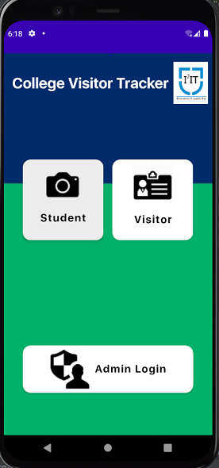
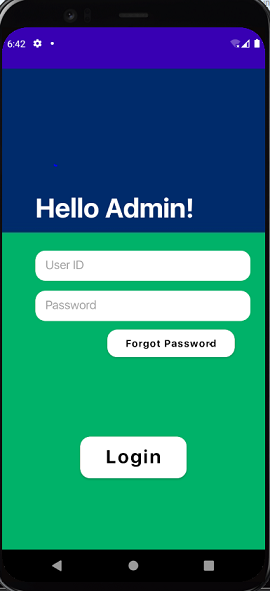
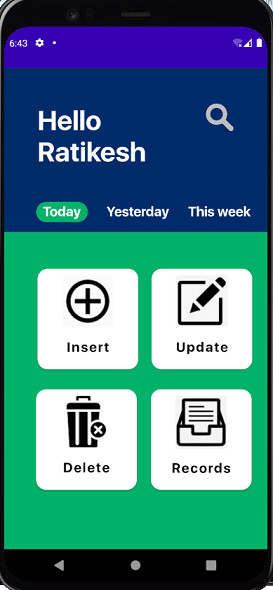

# CollegeHourTrack
Android app to manage Incoming and Outgoing People in Institutions

This is a Project which was made by me and @ratikeshgaonkar

1. In this project, we have implemented a concept of security system for school children with the help of QR code. Identification has become a necessary process in almost all fields. This app is concentrated on the main theme that is to reduce human effort and effective utilization of time. Due to this, accuracy of identification is maintained. The app reads the information of student i.e., PRN. Then it gets information from Database and sends the SMS to pre-stored parent’s mobile no. The SMS is sent with the help of Messaging API .Here the time and date maintained by using a System Clock. So finally the parent gets the information about their children’s attendance.
2. This new system is found to be much faster and reliable and user friendly then the existing system, the system has been designed and developed step by step and tested successfully. It eliminates the human error that are likely to creep in the kind of working in which a bulk quantity of data and steps as to be performed. The system results in quick retrieval of information that is very vital for the progress any organization. Cost is minimized in case of registers. Burden of manual work is reduced as whenever message is sent, there is no need to send it manually.

*	This student security concerned live updates system is developed with the aim to avoid crime, illegal activities by students and reduce worries among parents. 
*	The app includes scanner which scans the QR code on Student’s ID card and sends text alerts automatically to their parents.
*	Also, Non-ID card holders (Visitors) need to register through the app for entry into campus.
*	Admin panel helps admin to monitor all the records and update it if required. 

## Below are Some Screenshots for some Functionalities.
You can check the rest in the main Repo

